# Group 9 Machine 8 Cache Simulator

A web-based cache-memory simulator for comparing **Direct Mapped** and
**Fully Associative with Most Recently Used (MRU) replacement**.

- **Live application:** [Open the GitHub Pages deployment](https://abenojarfredrikzen.github.io/CSARCH2-CaseProject1-Grp9/)
- **Video walkthrough:** To be added after the final recording
- **Course:** CSARCH2
- **Section:** S04
- **Machine:** Machine 8

## Project overview

The simulator runs one shared block-access sequence through both cache
organizations. This keeps the comparison fair and makes it possible to inspect
every hit, miss, placement, eviction, cache snapshot, and timing result.

The interface supports the three required access patterns:

- Sequential
- Mid-repeat
- Random with a visible reproducible seed

It also provides step-by-step playback, a final-snapshot mode, a complete text
trace, and all statistical outputs required by the specification.

## Machine 8 specifications

| Parameter | Requirement | Simulator behavior |
|---|---|---|
| Block size | Parameterized, at least 2 words, power of two | Configurable with no fixed maximum |
| Cache blocks | Parameterized, at least 4 blocks, power of two | Configurable; required Sequential and Mid-repeat traces support up to 512 blocks |
| Main memory | Fixed at 1,024 blocks | Valid block indices are 0 through 1,023 |
| Read policy | Load-through or Non-load-through | Both policies are available |
| Cache comparison | Direct Mapped versus Fully Associative + MRU | Both receive the same sequence and settings |

## Implemented features

- Direct Mapped placement using `line = block mod cache blocks`
- Direct Mapped tags, hits, misses, and conflict evictions
- Fully Associative placement with true MRU replacement
- Empty caches at the start of every simulation
- Required Sequential, Mid-repeat, and Random generators
- Reproducible Random sequences using a visible numeric seed
- Shared immutable input for both cache organizations
- Per-step cache snapshots and a final cache snapshot
- Previous, Next, Play, Pause, Finish, and Reset controls
- Slow, Normal, and Fast playback speeds
- Step-by-step and final-snapshot modes
- Automatic scrolling for the active sequence token and trace row
- Hit, miss, eviction, and MRU visual states
- Complete synchronized trace log
- Input and main-memory boundary validation
- Load-through and Non-load-through timing calculations
- Desktop and laptop layout support
- Automated GitHub Pages deployment

## Required access sequences

Let `n` be the total number of cache blocks.

### Sequential

Access blocks `0` through `2n - 1`, then repeat that full sequence once.

```text
[0 ... 2n-1]
[0 ... 2n-1]
```

Total accesses: `4n`.

For `n = 4`:

```text
0,1,2,3,4,5,6,7,0,1,2,3,4,5,6,7
```

### Mid-repeat

```text
[0 ... n-1]
[0 ... 2n-1]
[0 ... 2n-1]
[n-1 ... 0]
[2n-1 ... 0]
[2n-1 ... 0]
```

Total accesses: `10n`.

For `n = 4`:

```text
0,1,2,3,
0,1,2,3,4,5,6,7,
0,1,2,3,4,5,6,7,
3,2,1,0,
7,6,5,4,3,2,1,0,
7,6,5,4,3,2,1,0
```

### Random

The Random generator produces exactly 64 block indices from `0` to `1023`.
Using the same seed produces the same sequence, which makes the test
repeatable and easier to verify.

## Required statistical outputs

The simulator reports these values separately for both cache organizations:

1. Total memory-access count
2. Cache-hit count
3. Cache-miss count
4. Cache-hit rate
5. Cache-miss rate
6. Average memory-access time
7. Total memory-access time

For every completed simulation:

```text
Total accesses = hits + misses
Hit rate + miss rate = 100%
Average access time = total time / total accesses
```

## Timing model and assumptions

The project specification requires timing results but does not provide fixed
timing constants or complete formulas. The simulator therefore exposes the
timing values as configurable assumptions.

- `C` = cache-access time
- `M` = first main-memory-word time
- `R` = each additional-word transfer time
- `B` = block size in words

```text
Hit                         = C
Load-through miss           = C + M
Non-load-through miss       = C + M + (B - 1)R + C
Total memory-access time    = sum of all event times
Average memory-access time  = total time / total accesses
```

Default values:

- `C = 1 ns`
- `M = 100 ns`
- `R = 10 ns`

These are simulator assumptions and should be changed if the instructor
provides official course values.

## Verified results

The following results use:

- Block size: 16 words
- Cache blocks: 16
- Read policy: Load-through
- Timing: `C = 1 ns`, `M = 100 ns`, and `R = 10 ns`
- Initially empty caches

| Test | Organization | Accesses | Hits | Misses | Hit rate | Miss rate | Average time | Total time |
|---|---|---:|---:|---:|---:|---:|---:|---:|
| Sequential | Direct Mapped | 64 | 0 | 64 | 0% | 100% | 101 ns | 6,464 ns |
| Sequential | Fully Associative + MRU | 64 | 16 | 48 | 25% | 75% | 76 ns | 4,864 ns |
| Mid-repeat | Direct Mapped | 160 | 16 | 144 | 10% | 90% | 91 ns | 14,560 ns |
| Mid-repeat | Fully Associative + MRU | 160 | 77 | 83 | 48.125% | 51.875% | 52.875 ns | 8,460 ns |
| Random, seed 20260803 | Direct Mapped | 64 | 1 | 63 | 1.5625% | 98.4375% | 99.4375 ns | 6,364 ns |
| Random, seed 20260803 | Fully Associative + MRU | 64 | 2 | 62 | 3.125% | 96.875% | 97.875 ns | 6,264 ns |

## Comparative analysis

### Sequential analysis

The Sequential trace repeatedly accesses twice as many blocks as the cache can
hold. Direct Mapped places each block in only one possible line. Blocks `0` and
`16`, for example, both use line `0` when the cache has 16 blocks. These
conflicts replace the first half of the sequence with the second half, causing
Direct Mapped to miss again throughout the second pass.

Fully Associative can place a block in any line. With MRU replacement, a miss
removes the block accessed most recently. This keeps some older blocks in the
cache long enough to be reused during the second pass. It therefore records 16
hits, while Direct Mapped records none.

### Mid-repeat analysis

Mid-repeat contains short repeated ranges, longer repeated ranges, and reverse
passes. Direct Mapped gains 16 early hits, but later blocks repeatedly conflict
with the same fixed lines.

Fully Associative + MRU records more hits because it has no fixed-line
conflicts. Its replacement behavior also preserves several older blocks that
become useful during the reverse portions. This produces 77 hits and a
48.125% hit rate, compared with Direct Mapped's 16 hits and 10% hit rate.

### Random analysis

The Random test chooses 64 blocks from a 1,024-block main memory. With only 16
cache blocks, most requests do not repeat while their blocks are still cached.
For seed `20260803`, Direct Mapped records one hit and Fully Associative + MRU
records two.

The Random outcome depends on the selected seed. The important checks are that
there are exactly 64 valid accesses, the same seed reproduces the same
sequence, and both organizations receive identical input.

### Overall comparison

Direct Mapped is simple and gives every block one fixed destination, but this
can create frequent conflict misses. Fully Associative avoids fixed-line
conflicts because every block can use any cache line. Its MRU policy is
different from the more common LRU policy: when the cache is full, it removes
the block accessed most recently.

For the required Sequential and Mid-repeat traces, Fully Associative + MRU
achieves more hits and lower average access times than Direct Mapped.

## Validation and edge cases

The interface checks the following cases:

- Minimum block size of 2 words
- Minimum cache size of 4 blocks
- Power-of-two block and cache sizes
- Empty, negative, decimal, and non-power-of-two configuration values
- Positive cache and first-memory timing values
- Non-negative additional-word timing
- Random seeds from 0 through 4,294,967,295
- Random block indices from 0 through 1,023
- Required traces that would exceed the 1,024-block main memory
- Configuration changes that invalidate old simulation results

Because Sequential and Mid-repeat access through block `2n - 1`, their largest
supported cache size is 512 blocks.

## Screenshot evidence

### Required sequence tests

### Valid configuration tests

### Invalid and Edge-Input tests

#### I01 - Non-power-of-two block size

Block size `3` is rejected because the block size must be a power of two and
at least 2 words.

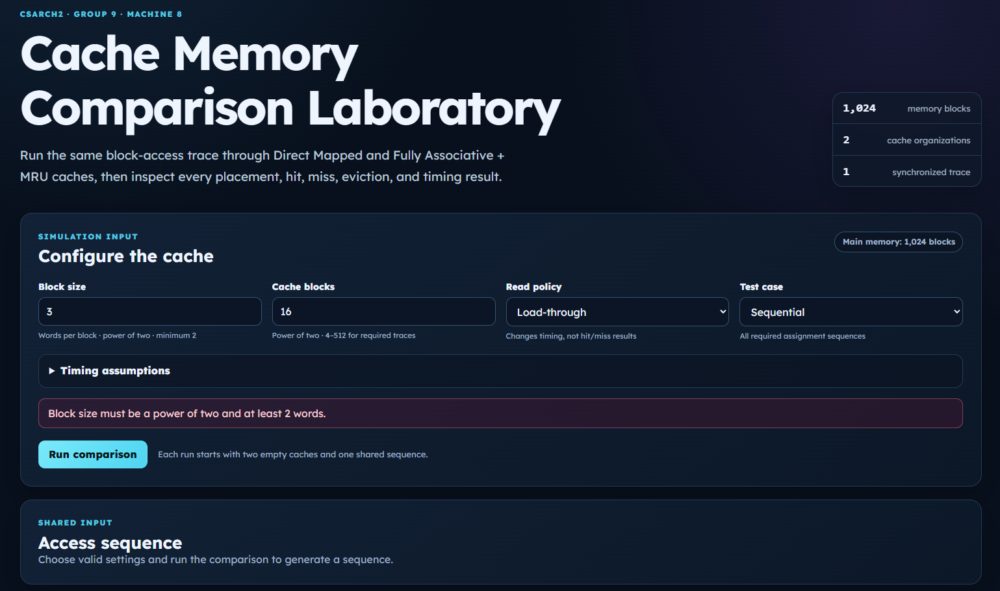

#### I02 - Non-power-of-two cache size

Cache size `6` is rejected because the number of cache blocks must be a power
of two and at least 4.


#### I03 - Required trace exceeds main memory

A cache size of `1024` is rejected for the Sequential test because its required
`0` to `2n - 1` trace would exceed the 1,024-block main memory.

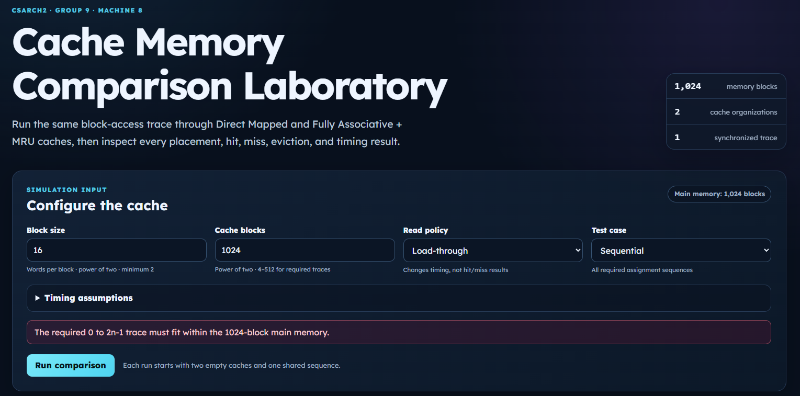

#### I04 - Decimal block size

Block size `2.5` is rejected because block sizes must be whole-number powers of
two.


#### I05 - Zero cache-access time

Cache-access time `0` is rejected because cache-access time must be a finite
positive number.

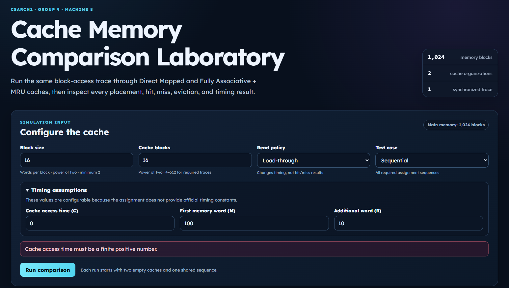

#### I06 - Random seed above the allowed range

Seed `4294967296` is rejected because the largest allowed seed is `4294967295`.

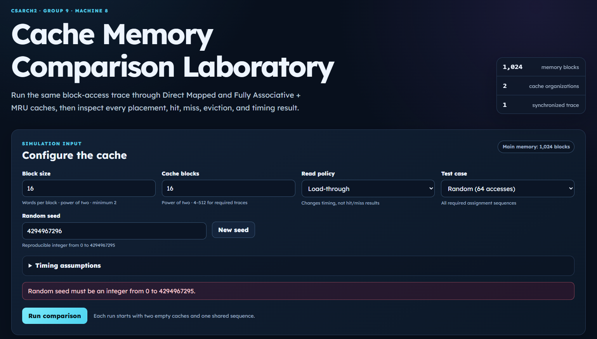

#### I07 - Blank Random seed

A blank Random seed is safely treated as seed `0`, producing a complete
64-access sequence without an error.

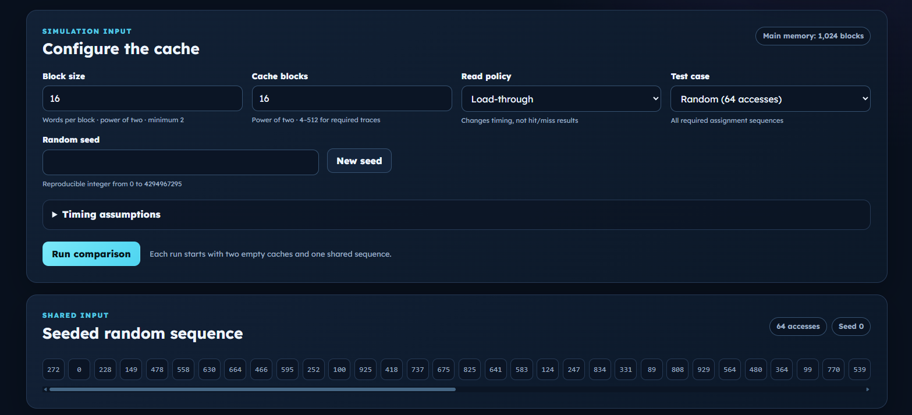

### Cache-operation tests

### Statistical-Output tests

### Read-policy and timing tests

The timing tests use cache-access time `C = 1 ns`, first-memory-word time
`M = 100 ns`, additional-word time `R = 10 ns`, 16 cache blocks, and the
Sequential sequence.

#### T01 - Block size 16 with Load-through

The first screenshot records the complete configuration used for the test.

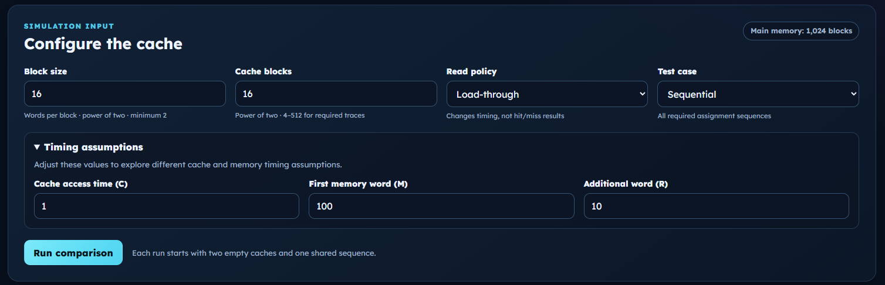

The final statistics show an average access time of `101 ns` for Direct Mapped
and `76 ns` for Fully Associative + MRU.

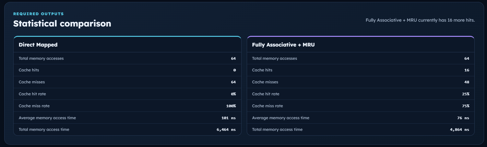

The first trace entry is a `101 ns` miss for both organizations, matching
`C + M = 1 + 100 = 101 ns`.

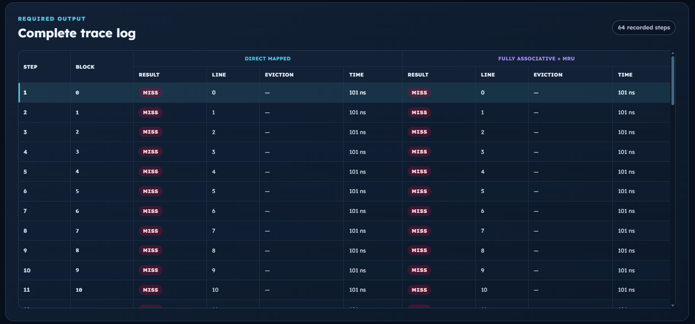

At Step 33, Direct Mapped records another `101 ns` miss while Fully Associative
+ MRU records a `1 ns` hit, matching the cache-hit time `C`.

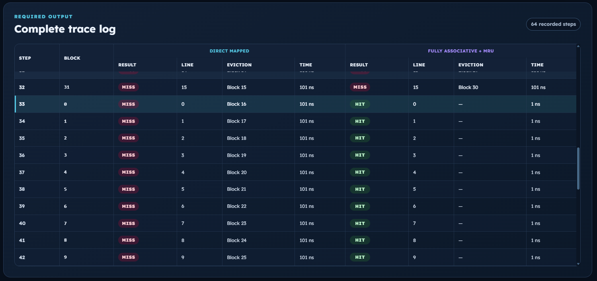

#### T02 - Block size 16 with Non-load-through

The configuration keeps the same sequence and timing values while changing
only the read policy to Non-load-through.

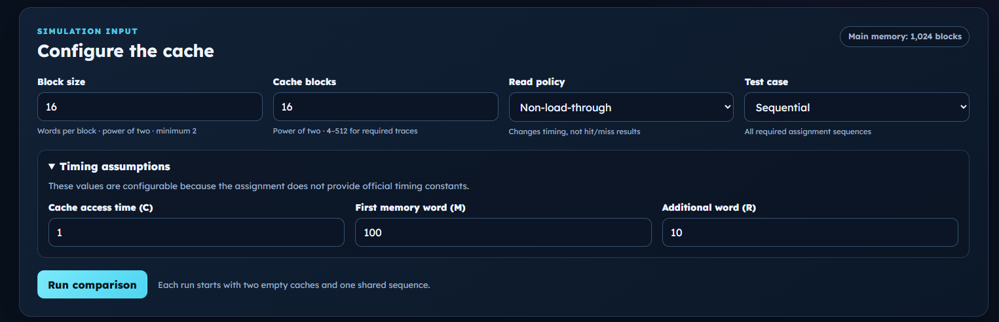

The final statistics show an average access time of `252 ns` for Direct Mapped
and `189.25 ns` for Fully Associative + MRU. The hit and miss counts remain the
same as the Load-through run.

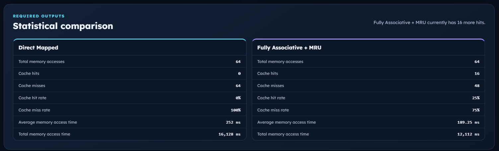

The first trace entry is a `252 ns` miss for both organizations, matching
`C + M + (B - 1)R + C = 1 + 100 + (15 x 10) + 1 = 252 ns`.

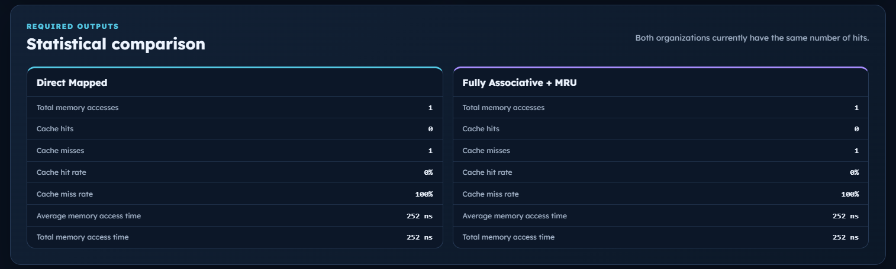

#### T03 - Block size 32 with Load-through

Increasing the block size to 32 does not change the Load-through miss time.


The average times remain `101 ns` for Direct Mapped and `76 ns` for Fully
Associative + MRU.

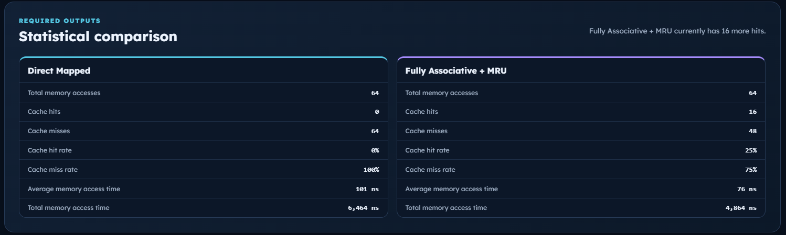

#### T04 - Block size 32 with Non-load-through

With a larger block, Non-load-through must wait for more additional-word
transfers.

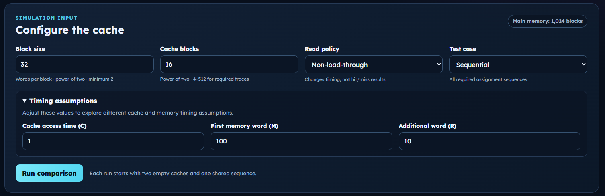

The miss time becomes
`1 + 100 + (31 x 10) + 1 = 412 ns`. The final averages are `412 ns` for Direct
Mapped and `309.25 ns` for Fully Associative + MRU.

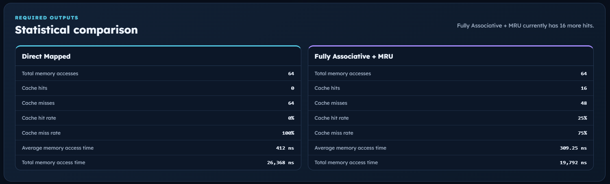

## How to use the simulator

1. Choose a valid block size and number of cache blocks.
2. Select Load-through or Non-load-through.
3. Select Sequential, Mid-repeat, or Random.
4. For Random, enter a seed or generate a new one.
5. Review the timing assumptions.
6. Select **Run comparison**.
7. Use the playback controls or choose **Final snapshot**.
8. Review both cache grids, the statistics, and the complete trace.

## Deployment

The production site is built and published through GitHub Actions whenever the
deployment workflow runs on the `main` branch.

[Open the live GitHub Pages application](https://abenojarfredrikzen.github.io/CSARCH2-CaseProject1-Grp9/)

## Team members and responsibilities

- ABENOJAR, Fredrikzen
- DOLLENTAS, Raine
- OBREGON, Sian
- SINGSON, Keith Railey

## Video walkthrough

The final five-to-eight-minute walkthrough should demonstrate:

- The recommended configuration
- Sequential, Mid-repeat, and Random tests
- Direct Mapped and Fully Associative + MRU behavior
- Step-by-step and final-snapshot modes
- The complete trace and statistical outputs
- Valid and invalid configurations
- Load-through and Non-load-through timing
- The live GitHub Pages deployment

**YouTube URL:** To be added after upload